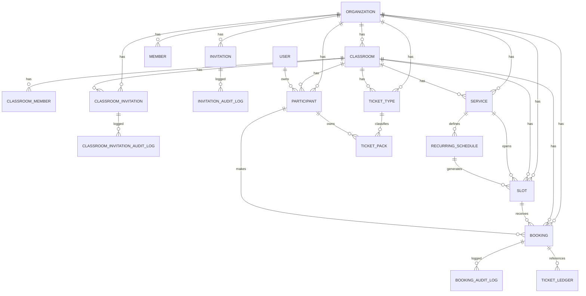

# DB説明とER（Org + Classroom）

最終更新: 2026-03-06  
参照: `apps/backend/src/db/schema.ts`

## 1. 概要

権限・予約は `organization` と `classroom` の2階層で管理する。

- `organization`: 全体Org
- `classroom`: 教室
- 予約ドメインの主要テーブルは `classroom_id` を必須保持

## 2. 主要テーブル

### 認証

- `user`
- `session`
- `account`
- `verification`

### 組織・教室・メンバー

- `organization`
- `classroom`
- `member`（Org member）
- `classroom_member`（Classroom role）
- `participant`

### 招待

- `invitation`（organization plugin 招待）
- `invitation_audit_log`
- `classroom_invitation`（participant 招待）
- `classroom_invitation_audit_log`

### 予約/回数券

- `service`
- `recurring_schedule`
- `recurring_schedule_exception`
- `slot`
- `booking`
- `booking_audit_log`
- `ticket_type`
- `ticket_pack`
- `ticket_purchase`
- `ticket_ledger`

## 3. 制約の要点

- `participant` unique:
  - `(organization_id, user_id)`
  - `(organization_id, email)`
- `slot` unique:
  - `(organization_id, recurring_schedule_id, start_at)`
- `booking` unique:
  - `(slot_id, participant_id)`
- `classroom_invitation` / `classroom_invitation_audit_log` は `classroom_id` 必須

## 4. ER図（簡略）

