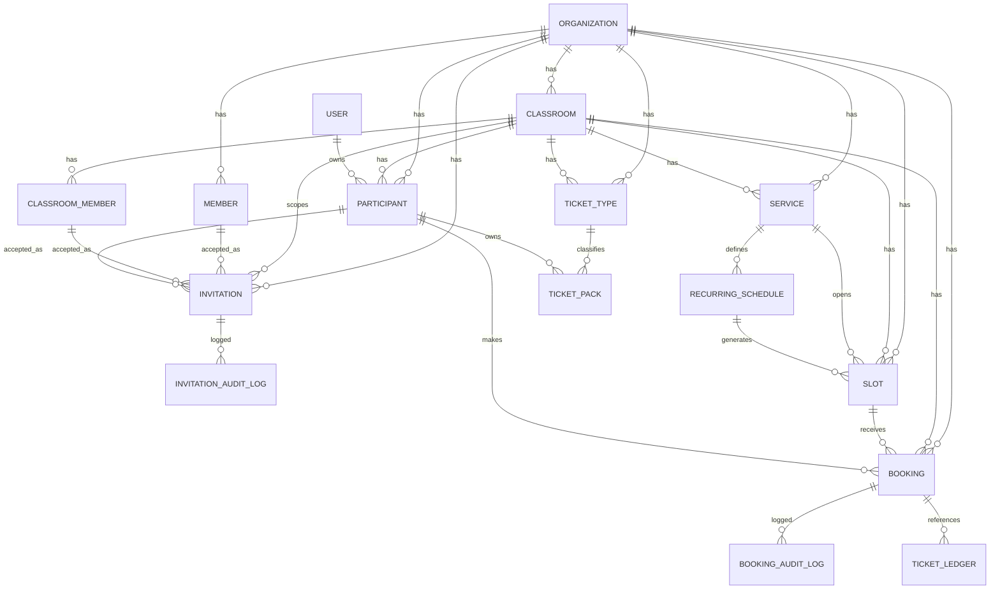

# DB説明とER（Org + Classroom）

最終更新: 2026-03-10
参照: `apps/backend/src/db/schema.ts`

## 1. 概要

権限・予約は `organization` と `classroom` の2階層で管理する。

- `organization`: 全体Org
- `classroom`: 教室
- 予約ドメインの主要テーブルは `classroom_id` を必須保持
- 招待は `invitation` / `invitation_audit_log` に統一済み

## 2. 主要テーブル

### 認証

- `user`
- `session`
- `account`
- `verification`

### 組織・教室・メンバー

- `organization`
- `classroom`
- `member`（Org member）
- `classroom_member`（Classroom staff role）
- `participant`

### 招待

- `invitation`
  - `subject_kind`: `org_operator | classroom_operator | participant`
  - `role`: `admin | member | manager | staff | participant`
  - `principal_kind`: `email | existing_user`
  - `accepted_member_id | accepted_classroom_member_id | accepted_participant_id`
- `invitation_audit_log`
  - `action`: `created | resent | accepted | rejected | cancelled | expired`

### 予約/回数券

- `service`
- `recurring_schedule`
- `recurring_schedule_exception`
- `slot`
- `booking`
- `booking_audit_log`
- `ticket_type`
- `ticket_pack`
- `ticket_purchase`
- `ticket_ledger`

## 3. 制約とインデックスの要点

- `participant` unique:
  - `(organization_id, classroom_id, user_id)`
  - `(organization_id, classroom_id, email)`
- `slot` unique:
  - `(organization_id, recurring_schedule_id, start_at)`
- `booking` unique:
  - `(slot_id, participant_id)`
- `invitation`:
  - `organization_id` は必須
  - `classroom_id` は org operator 招待では `null`、classroom/participant 招待では設定
  - `subject_kind + status`
  - `(organization_id, classroom_id, status)`
  - `(organization_id, subject_kind, role, status)`
  - `email`
- `invitation_audit_log`:
  - `(invitation_id, action)`
  - `(organization_id, created_at)`
  - `(actor_user_id, created_at)`

`apps/backend/drizzle/0011_unified_invitations.sql` で legacy `invitation` と `classroom_invitation` を単一モデルへ移行している。

## 4. ER図（簡略）

