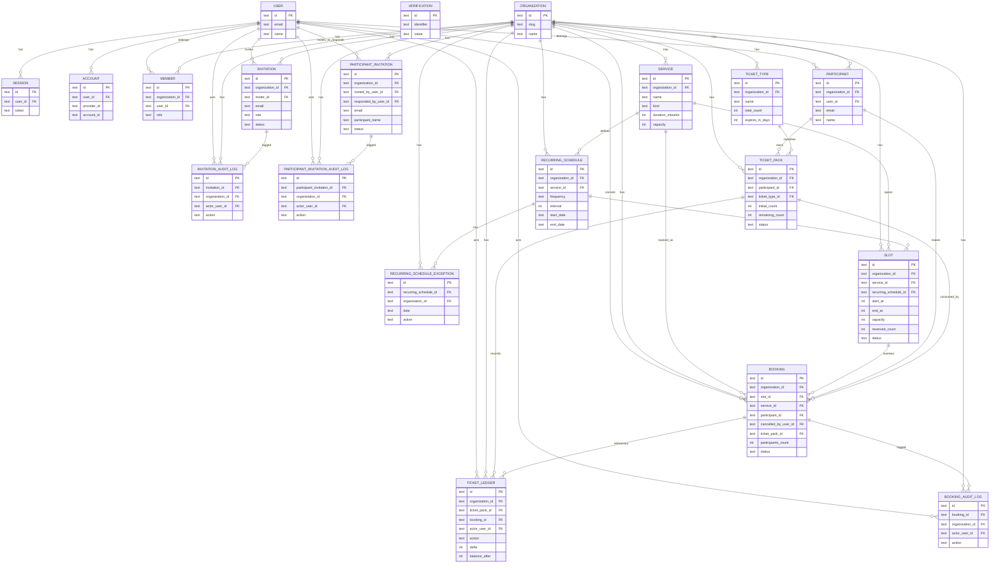

# 予約管理システム DB説明とER図

最終更新: 2026-02-17  
参照元: `apps/backend/src/db/schema.ts`

## 1. 概要

このDBは以下の4ドメインで構成される。

1. 認証・アカウント（Better Authコア）
2. 組織・招待（管理者招待 / 参加者招待）
3. 予約管理（service / slot / recurring schedule / booking）
4. 回数券・監査ログ

## 2. テーブル説明

### 2.1 認証・アカウント

- `user`: ユーザー本体
- `session`: セッション情報（`user_id` FK）
- `account`: OAuth/認証プロバイダ連携情報（`user_id` FK）
- `verification`: 認証用トークン・検証値

### 2.2 組織・招待・参加者

- `organization`: 組織
- `member`: 組織メンバー（`organization_id` FK, `user_id` FK）
- `participant`: 予約主体の参加者（`organization_id` FK, `user_id` FK）
  - Unique: `(organization_id, user_id)`, `(organization_id, email)`
- `invitation`: 管理者招待（Better Auth organization invitation）
- `invitation_audit_log`: 管理者招待の監査ログ
- `participant_invitation`: 参加者招待
- `participant_invitation_audit_log`: 参加者招待の監査ログ

### 2.3 予約管理

- `service`: 予約メニュー（単発/定期）
- `recurring_schedule`: 定期スケジュール定義
- `recurring_schedule_exception`: 定期スケジュール例外（休講/上書き）
  - Unique: `(recurring_schedule_id, date)`
- `slot`: 予約可能枠
  - Unique: `(organization_id, recurring_schedule_id, start_at)`（定期生成重複防止）
- `booking`: 予約
  - Unique: `(slot_id, participant_id)`（同一枠の二重予約防止）
- `booking_audit_log`: 予約操作監査ログ

### 2.4 回数券

- `ticket_type`: 回数券種別
- `ticket_pack`: 参加者への付与回数券
- `ticket_ledger`: 付与/消費/戻しの台帳

## 3. 実装上の補足

- `booking.ticket_pack_id -> ticket_pack.id` はFK制約あり（`ON DELETE SET NULL`）。
- `ticket_ledger.booking_id -> booking.id` はFK制約あり（`ON DELETE SET NULL`）。
- `slot.reserved_count` は予約作成/取消で増減し、0未満にならない条件で更新する。
- 監査ログ系はすべて「成功時のみ記録」を前提とする。

## 4. ER図（Mermaid）

