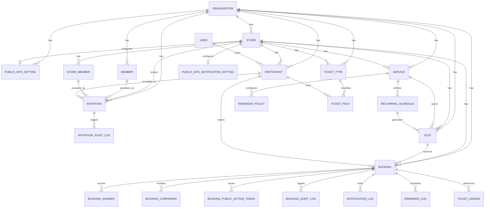

# DB説明とER（Org + Store）

最終更新: 2026-05-31
参照: `apps/backend/src/infra/db/schema.ts`

現行DBの全テーブル、リレーション、静的ER図は [database-er-reference.html](./database-er-reference.html) を参照。

## 1. 概要

権限・予約は `organization` と `store` の2階層で管理する。

- `organization`: 全体Org
- `store`: 店舗
- 予約ドメインの主要テーブルは `store_id` を必須保持
- 招待は `invitation` / `invitation_audit_log` に統一済み

## 2. 主要テーブル

### 認証

- `user`
- `session`
- `account`
- `verification`

### 組織・店舗・メンバー

- `organization`
- `store`
- `public_site_setting`
- `member`（Org member）
- `store_member`（Store staff role）
- `participant`

### 招待

- `invitation`
  - `subject_kind`: `org_operator | store_operator | participant`
  - `role`: `admin | member | manager | staff | participant`
  - `principal_kind`: `email | existing_user`
  - `accepted_member_id | accepted_store_member_id | accepted_participant_id`
- `invitation_audit_log`
  - `action`: `created | resent | accepted | rejected | cancelled | expired`

### 予約/回数券

- `service`
- `recurring_schedule`
- `recurring_schedule_exception`
- `slot`
- `booking`
- `booking_answer`
- `booking_companion`
- `booking_public_action_token`
- `booking_audit_log`
- `public_site_notification_setting`
- `notification_log`
- `reminder_policy`
- `reminder_log`
- `ticket_type`
- `ticket_pack`
- `ticket_purchase`
- `ticket_ledger`

## 3. 制約とインデックスの要点

- `participant` unique:
  - `(organization_id, store_id, user_id)`
  - `(organization_id, store_id, email)`
- `slot` unique:
  - `(organization_id, recurring_schedule_id, start_at)`
- `booking` unique:
  - `(slot_id, participant_id)`
- `invitation`:
  - `organization_id` は必須
  - `store_id` は org operator 招待では `null`、store/participant 招待では設定
  - `subject_kind + status`
  - `(organization_id, store_id, status)`
  - `(organization_id, subject_kind, role, status)`
  - `email`
- `invitation_audit_log`:
  - `(invitation_id, action)`
  - `(organization_id, created_at)`
  - `(actor_user_id, created_at)`

`apps/backend/drizzle/0011_unified_invitations.sql` で旧個別招待テーブルを単一モデルへ移行している。

## 4. ER図（簡略）

```mermaid
erDiagram
  ORGANIZATION ||--o{ STORE : has
  ORGANIZATION ||--o{ PUBLIC_SITE_SETTING : has
  STORE ||--o| PUBLIC_SITE_SETTING : configures
  ORGANIZATION ||--o{ MEMBER : has
  STORE ||--o{ STORE_MEMBER : has

  ORGANIZATION ||--o{ PARTICIPANT : has
  STORE ||--o{ PARTICIPANT : has
  USER ||--o{ PARTICIPANT : owns

  ORGANIZATION ||--o{ INVITATION : has
  STORE ||--o{ INVITATION : scopes
  MEMBER ||--o{ INVITATION : accepted_as
  STORE_MEMBER ||--o{ INVITATION : accepted_as
  PARTICIPANT ||--o{ INVITATION : accepted_as
  INVITATION ||--o{ INVITATION_AUDIT_LOG : logged

  ORGANIZATION ||--o{ SERVICE : has
  STORE ||--o{ SERVICE : has
  SERVICE ||--o{ RECURRING_SCHEDULE : defines

  ORGANIZATION ||--o{ SLOT : has
  STORE ||--o{ SLOT : has
  SERVICE ||--o{ SLOT : opens
  RECURRING_SCHEDULE ||--o{ SLOT : generates

  ORGANIZATION ||--o{ BOOKING : has
  STORE ||--o{ BOOKING : has
  SLOT ||--o{ BOOKING : receives
  PARTICIPANT ||--o{ BOOKING : makes
  BOOKING ||--o{ BOOKING_ANSWER : records
  BOOKING ||--o{ BOOKING_COMPANION : includes
  BOOKING ||--o{ BOOKING_PUBLIC_ACTION_TOKEN : issues
  BOOKING ||--o{ BOOKING_AUDIT_LOG : logged
  STORE ||--o| PUBLIC_SITE_NOTIFICATION_SETTING : configures
  BOOKING ||--o{ NOTIFICATION_LOG : emits
  SERVICE ||--o{ REMINDER_POLICY : configures
  BOOKING ||--o{ REMINDER_LOG : schedules

  ORGANIZATION ||--o{ TICKET_TYPE : has
  STORE ||--o{ TICKET_TYPE : has
  TICKET_TYPE ||--o{ TICKET_PACK : classifies
  PARTICIPANT ||--o{ TICKET_PACK : owns
  BOOKING ||--o{ TICKET_LEDGER : references
```
